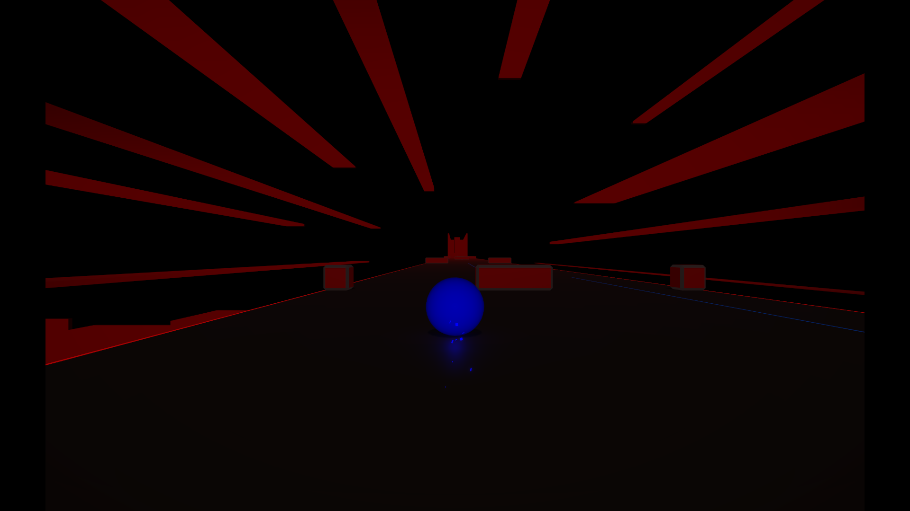
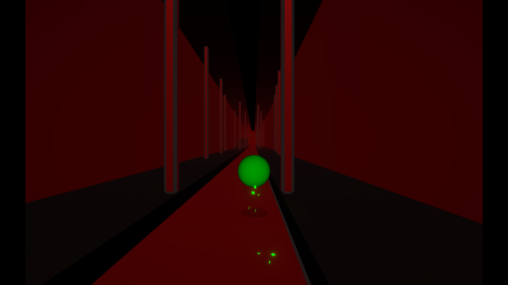
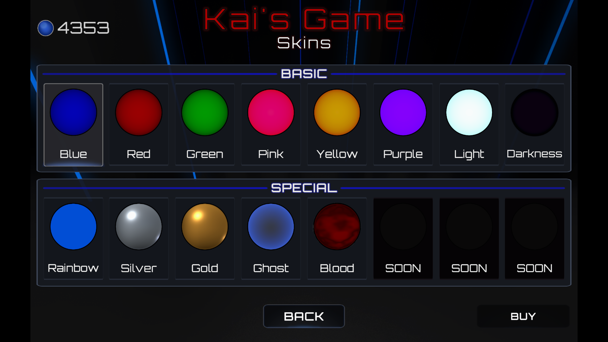
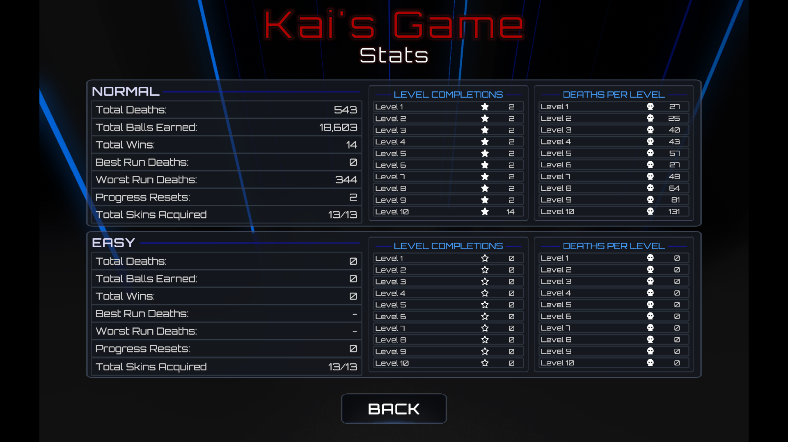

  

<h1 align="center">Kai's Game</h1>

  A challenging 3D obstacle-runner independently developed in Unity and C#.

  <a href="media/kais-game-trailer.mp4"><strong>Watch the GitHub Trailer</strong></a>
  &nbsp;•&nbsp;
  <a href="https://github.com/kaiforsyth-git/kais-game/releases"><strong>Download the Windows Build</strong></a>

## About the Game

Kai's Game is a fast-paced 3D obstacle runner built around precise movement, increasingly difficult levels and unlockable cosmetic skins.

The current Alpha release contains ten playable levels, persistent statistics, unlockable rewards and developer tools for quickly reviewing the game.

## Features

- Ten progressively challenging levels
- Physics-based player movement
- Checkpoints and level progression
- Unlockable cosmetic skins
- Persistent player statistics and save data
- Custom menus, pause screen and settings
- Developer and reviewer controls
- Original visual effects created with Unity Shader Graph

## Screenshots

  
  

  
  

## Download

The playable Windows Alpha build is available from the repository's **Releases** section.

1. Download the Windows ZIP file.
2. Extract the complete folder.
3. Launch `Kai's Game.exe`.

Windows may display a security warning because the Alpha build is not digitally signed.

## Development

Kai's Game was independently designed and developed using:

- Unity
- C#
- Shader Graph
- Blender
- DaVinci Resolve

This repository contains the game's portfolio presentation, media and playable releases. The complete Unity source project is not publicly included.

## Current Status

**Alpha v0.1**

The game is functional and playable, but additional content, balancing and visual improvements are still planned.
